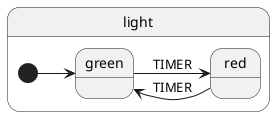

# xstate-plantuml

[](https://www.npmjs.com/package/xstate-plantuml)
[](https://travis-ci.org/lucmartens/xstate-plantuml/)

Visualize a [xstate](https://github.com/davidkpiano/xstate) or [react-automata](https://github.com/MicheleBertoli/react-automata) statechart as a [plantuml](https://github.com/plantuml/plantuml) state diagram.

## Installation

```
npm install xstate-plantuml
```

## Usage

import `xstate-plantuml` and call it's default export using a xstate config or machine

```js
import visualize from 'xstate-plantuml';

const config = {
  key: 'light',
  initial: 'green',
  states: {
    green: {
      on: {
        TIMER: 'red'
      }
    },
    red: {
      on: {
        TIMER: 'green'
      }
    }
  }
};

visualize(config);
```

Which returns a string containing the following plantuml source



Which you can compile to the following image


## Options

In addition to a state machine, `visualize` accepts an options map

| option      | default | description                                                       |
| ----------- | ------- | ----------------------------------------------------------------- |
| leftToRight | true    | whether to render left to right or top to bottom                  |
| skinParams  | []      | Additional [skinparams](http://plantuml.com/skinparam) to include |

```js
visualize(config, {
  leftToRight: false,
  skinParams: ['monochrome true']
});
```


## Examples

### Hierarchical state

- [json](./examples/alarm.json)
- [puml](./examples/alarm.puml)


### Parallel state

- [json](./examples/text-editor.json)
- [puml](./examples/text-editor.puml)


## History state

- [json](./examples/payment.json)
- [puml](./examples/payment.puml)


## Internal transitions

- [json](./examples/word.json)
- [puml](./examples/word.puml)


## Guards, actions and activities

- [json](./examples/download.json)
- [puml](./examples/download.puml)


