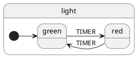
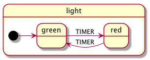
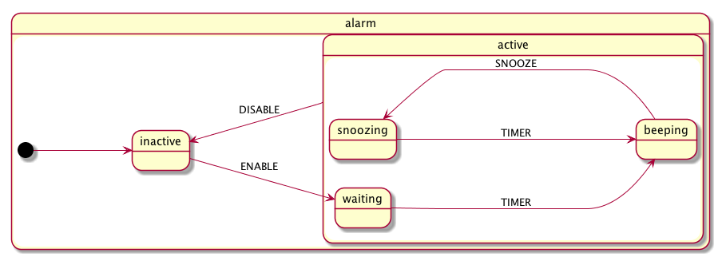
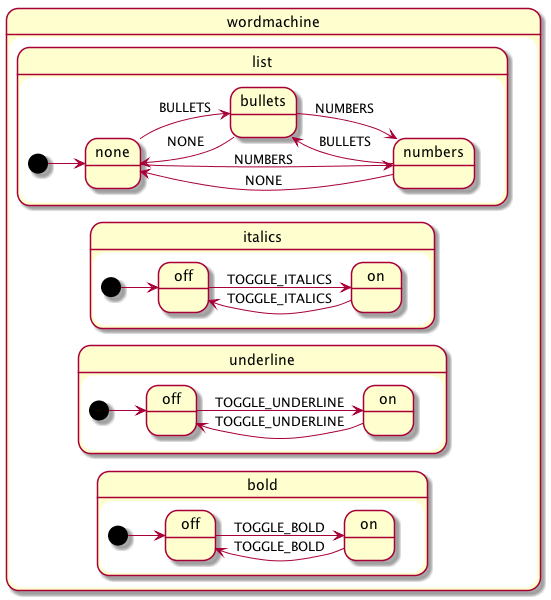
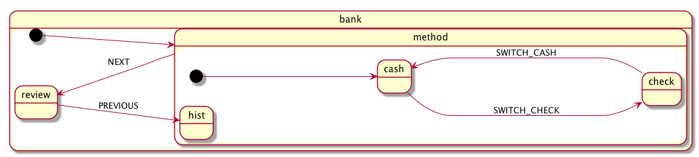

# xstate-plantuml

Visualize a [xstate](https://github.com/davidkpiano/xstate) or [react-automata](https://github.com/MicheleBertoli/react-automata) statechart as a [plantuml](https://github.com/plantuml/plantuml) state diagram.

## Installation

```
npm install xstate-plantuml
```

## Usage

import xstate-plantuml and call it's default export using a xstate config or machine

```js
import visualize from 'xstate-plantuml';

const config = {
  key: 'light',
  initial: 'green',
  states: {
    green: {
      on: {
        TIMER: 'red'
      }
    },
    red: {
      on: {
        TIMER: 'green'
      }
    }
  }
};

visualize(config);
```

Which returns a string containing the following plantuml source



Which you can compile to the following image



## Examples

### Hierarchical state

- [json](./examples/alarm.json)
- [puml](./examples/alarm.puml)



### Parallel state

- [json](./examples/parallel.json)
- [puml](./examples/parallel.puml)



## History state

- [json](./examples/bank.json)
- [puml](./examples/bank.puml)


